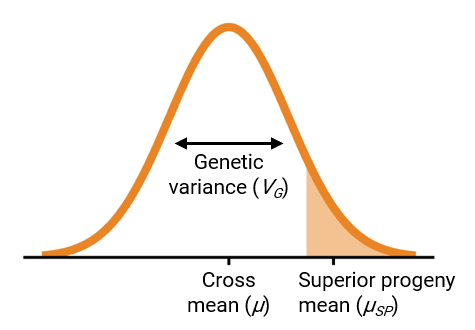

```{r, include = FALSE}
knitr::opts_chunk$set(
  # eval = FALSE,
  collapse = TRUE,
  comment = "#>"
)
```


# Introduction

To make progress in breeding, populations should have a favorable mean and high genetic variance (Bernardo 2010). These two parameters can be combined into a single measure called the usefulness criterion (Schnell and Utz 1975), visualized in Figure 1.




Ideally, breeders would identify the set of parent combinations that, when realized in a cross, would give rise to populations meeting these requirements. `PopVar` is a package that uses phenotypic and genomewide marker data on a set of candidate parents to predict the mean, genetic variance, and superior progeny mean in bi-parental or multi-parental populations. Thre package also contains functionality for performing cross-validation to determine the suitability of different statistical models. More details are available in Mohammadi, Tiede, and Smith (2015). A dataset `think_barley` is included for reference and examples.


## Installation

You can install the released version of PopVar from [CRAN](https://CRAN.R-project.org) with:

``` r
install.packages("PopVar")
```

And the development version from [GitHub](https://github.com/) with:

``` r
# install.packages("devtools")
devtools::install_github("UMN-BarleyOatSilphium/PopVar")
```


## Functions

Below is a description of the functions provided in `PopVar`:

| Function        | Description                     |
|:-----------------|:--------------------------------|
| `pop.predict` | Uses simulations to make predictions in recombinant inbred line populations; can internally perform cross-validation for model selections; can be quite slow. |
| `pop.predict2` | Uses deterministic equations to make predictions in populations of complete or partial selfing and with or without the induction of doubled haploids; is much faster than `pop.predict`; does not perform cross-validation or model selection internally. |
| `pop_predict2` | Has the same functionality as `pop.predict2`, but accepts genomewide marker data in a simpler matrix format. |
| `x.val` | Performs cross-validation to estimate model performance. |
| `mppop.predict` | Uses deterministic equations to make predictions in 2- or 4-way populations of complete or partial selfing and with or without the induction of doubled haploids; does not perform cross-validation or model selection internally. |
| `mpop_predict2` | Has the same functionality as `mppop.predict`, but accepts genomewide marker data in a simpler matrix format. |


# Examples

Below are some example uses of the functions in `PopVar`:

```{r example, eval = TRUE}
# Load the package
library(PopVar)

# Load the example data
data("think_barley", package = "PopVar")
```


## Predictions using simulated populations

The code below simulates a single population of 1000 individuals for each of `r nrow(cross.tab_ex)` crosses. For the sake of speed, the marker effects are predicted using RR-BLUP and no cross-validation is performed.

```{r example1, message=FALSE, results='hide'}
out <- pop.predict(G.in = G.in_ex, y.in = y.in_ex, map.in = map.in_ex,
                   crossing.table = cross.tab_ex,
                   nInd = 1000, nSim = 1, 
                   nCV.iter = 1, models = "rrBLUP")
```

The function returns a list, one element of which is called `predictions.` This element is itself a list of matrices containing the predictions for each trait. They can be combined as such:

```{r combine1}
predictions1 <- lapply(X = out$predictions, FUN = function(x) {
  x1 <- as.data.frame(apply(X = x, MARGIN = 2, FUN = unlist), stringsAsFactors = FALSE)
  cbind(x1[,c("Par1", "Par2")], sapply(X = x1[,-1:-2], as.numeric)) 
})

# Display the first few lines of the predictions for grain yield
knitr::kable(head(predictions1$Yield_param.df))

```


## Predictions using deterministic equations

Generating predictions via simulated populations can become computationally burdensome when many thousands or hundreds of thousands of crosses are possible. Fortunately, deterministic equations are available to generate equivalent predictions in a fraction of the time. These equations are provided in the `pop.predict2` and `pop_predict2` functions.

The `pop.predict2` function takes arguments in the same format as `pop.predict`. We have eliminated the arguments for marker filtering and imputation and cross-validation, as the `pop.predict2` function does not support these steps. (You may continue to conduct cross-validation using the `x.val` function.) Therefore, the genotype data input for `pop.predict2` **must not contain any missing data**. Further, these predictions assume fully inbred parents, so marker genotypes must only be coded as -1 or 1. The data `G.in_ex_imputed` contains genotype data that is formatted properly.

Below is an example of using the `pop.predict2` function:


```{r example2}
out2 <- pop.predict2(G.in = G.in_ex_imputed, y.in = y.in_ex, map.in = map.in_ex,
                     crossing.table = cross.tab_ex, models = "rrBLUP")

knitr::kable(head(subset(out2, trait == "Yield")))

```

> Note that the output of `pop.predict2` is no longer a list, but a data frame containing the combined predictions for all traits.

The formatting requirements of `G.in` for `pop.predict` and `pop.predict2` are admittedly confusing. Marker genotype data is commonly stored as a *n* x *p* matrix, where *n* is the number of entries and *p* the number of markers. The function `pop_predict2` accommodates this general marker data storage. Here is an example:

```{r example3}
out3 <- pop_predict2(M = G.in_ex_mat, y.in = y.in_ex, map.in = map.in_ex,
                     crossing.table = cross.tab_ex, models = "rrBLUP")

knitr::kable(head(subset(out2, trait == "Yield")))

```


### Benchmarking and comparisons

The code below compares the functions `pop.predict` and `pop.predict2` with respect to computation time and results:

```{r compare1, message=FALSE}
time1 <- system.time({
  capture.output(pop.predict.out <- pop.predict(
    G.in = G.in_ex_imputed, y.in = y.in_ex, map.in = map.in_ex, crossing.table = cross.tab_ex,
    nInd = 1000, nSim = 1, nCV.iter = 1, models = "rrBLUP"))
})

time2 <- system.time({pop.predict2.out <- pop.predict2(
  G.in = G.in_ex_imputed, y.in = y.in_ex, map.in = map.in_ex,
  crossing.table = cross.tab_ex,model = "rrBLUP")})

# Print the time (seconds) required for each function.
c(pop.predict = time1[[3]], pop.predict2 = time2[[3]])

```


Plot results

```{r compare2}
predictions1 <- lapply(X = pop.predict.out$predictions, FUN = function(x) {
  x1 <- as.data.frame(apply(X = x, MARGIN = 2, FUN = unlist), stringsAsFactors = FALSE)
  cbind(x1[,c("Par1", "Par2")], sapply(X = x1[,-1:-2], as.numeric))
})

pop.predict.out1 <- predictions1$Yield_param.df[,c("Par1", "Par2", "pred.varG")]
pop.predict2.out1 <- subset(pop.predict2.out, trait == "Yield", c(parent1, parent2, pred_varG))

toplot <- merge(pop.predict.out1, pop.predict2.out1, by.x = c("Par1", "Par2"),
                by.y = c("parent1", "parent2"))

plot(pred.varG ~ pred_varG, toplot,
     xlab = "pop.predict2", ylab = "pop.predict",
     main = "Comparsion of predicted genetic variance")

```


## Multi-parent populations

`PopVar` also includes functions for predicting the mean, genetic variance, and superior progeny mean of multi-parent populations. The `mppop.predict` function takes the same inputs as `pop.predict` or `pop.predict2`, and the `mppop_predict2` function takes the same inputs as `pop_predict2`. Both require the additional argument `n.parents`, which will determine whether the populations are formed by 2- or 4-way matings (support for 8-way populations is forthcoming.)

Below is an example of using the `mppop.predict` function:


```{r mp.example1}
# Generate predictions for all possible 4-way crosses of 10 sample parents
sample_parents <- sample(unique(unlist(cross.tab_ex)), 10)

mp_out <- mppop.predict(G.in = G.in_ex_imputed, y.in = y.in_ex, map.in = map.in_ex,
                        parents = sample_parents, n.parents = 4, models = "rrBLUP")

knitr::kable(head(subset(mp_out, trait == "Yield")))

```


Below is an example of using the `mppop_predict2` function:


```{r mp.example2}
# Generate predictions for all possible 4-way crosses of 10 sample parents
mp_out2 <- mppop_predict2(M = G.in_ex_mat, y.in = y.in_ex, map.in = map.in_ex,
                          parents = sample_parents, n.parents = 4, models = "rrBLUP")

knitr::kable(head(subset(mp_out2, trait == "Yield")))

```


# References


Bernardo, Rex. 2010. Breeding for Quantitative Traits in Plants. 2nd ed. Woodbury, Minnesota: Stemma Press.

Mohammadi, Mohsen, Tyler Tiede, and Kevin P. Smith. 2015. “PopVar: A Genome-Wide Procedure for Predicting Genetic Variance and Correlated Response in Biparental Breeding Populations.” Crop Science 55 (5): 2068–77. <https://doi.org/10.2135/cropsci2015.01.0030>.

Schnell, F. W., and H. F. Utz. 1975. “F1-leistung und elternwahl euphyder züchtung von selbstbefruchtern.” In Bericht über Die Arbeitstagung Der Vereinigung Österreichischer Pflanzenzüchter, 243–48. Gumpenstein, Austria: BAL Gumpenstein.


